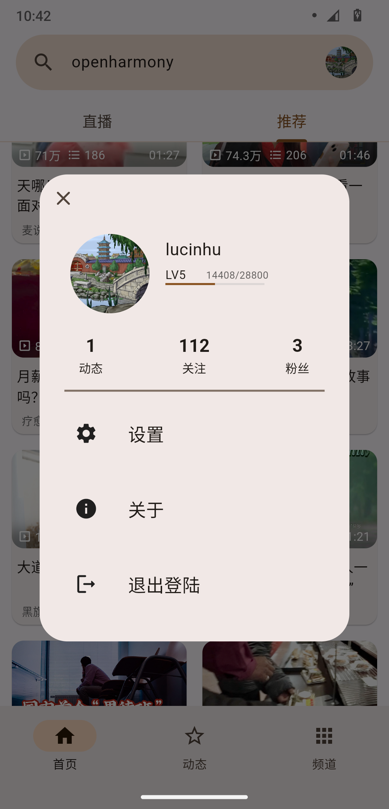
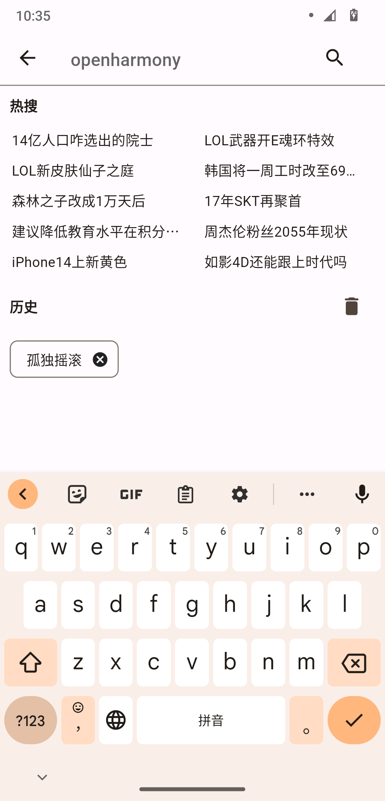

# Bili You

一个用flutter制作的第三方B站客户端.

## 功能实现

- [x] 主页视频推荐
- [x] 视频搜索
- [x] 评论区
- [x] 评论区楼中楼
- [x] 评论图片及笔记
- [x] 相关视频
- [x] 热搜
- [x] 视频播放
- [x] 弹幕
- [ ] 直播
- [x] 动态(未完善)
- [x] 用户投稿
- [x] 番剧搜索
- [x] 番剧播放

## 截图

## 交流

Discord：[https://discord.gg/tsFh7Hdb4s](https://discord.gg/tsFh7Hdb4s)  

## 声明

- 此项目是个人为了兴趣而开发, 仅供学习交流使用, 无任何商业用途.  
- 资源版权仍归原网站或其作者所有.  
- 所用API皆从官方网站收集, 不含任何非法及破解内容.  

## 感谢

- [bilibili-API-collect](https://github.com/SocialSisterYi/bilibili-API-collect): 哔哩哔哩API收集，感谢@SocialSisterYi及各位贡献者的维护！  
- [flutter_ns_danmaku](https://github.com/xiaoyaocz/flutter_ns_danmaku): @xiaoyaocz大佬制作的flutter弹幕插件，非常感谢!  
- [media_kit](https://github.com/alexmercerind/media_kit): 感谢@alexmercerind大佬制作的media_kit播放器!  
